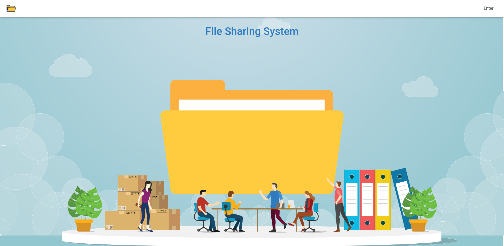
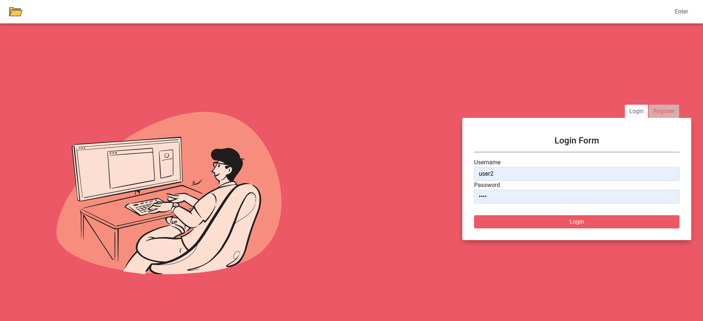
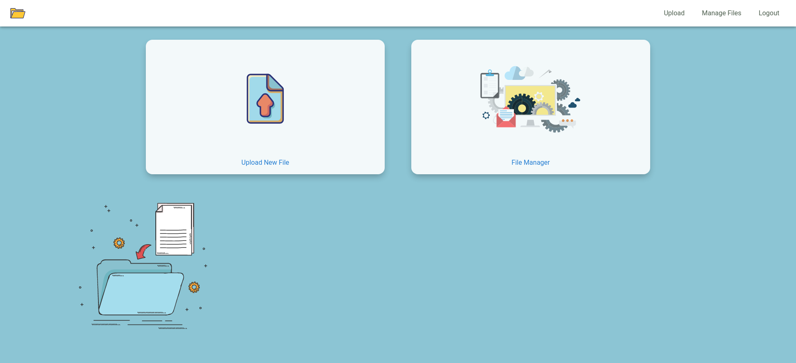
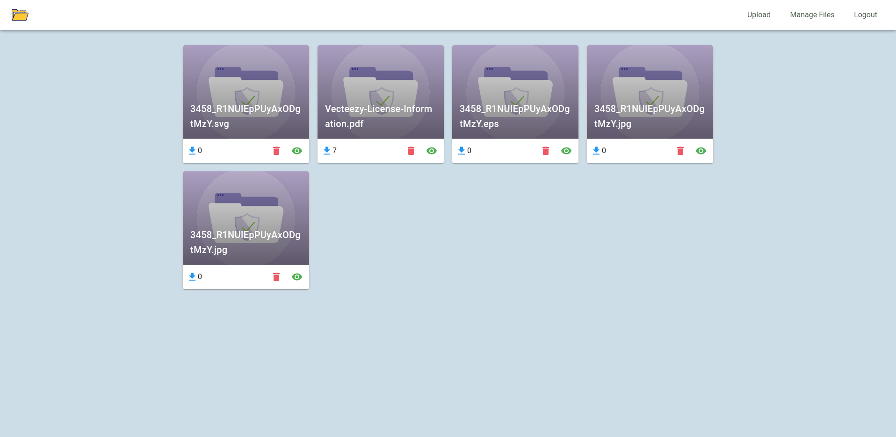
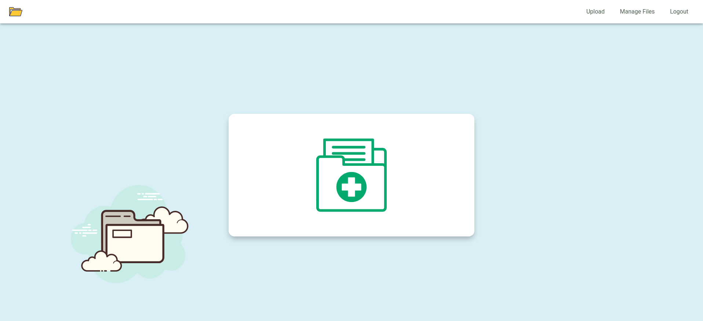
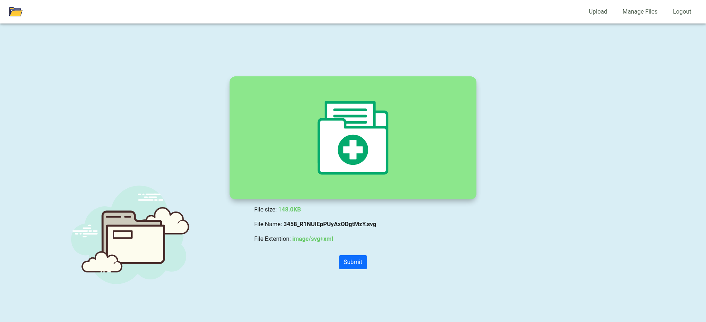
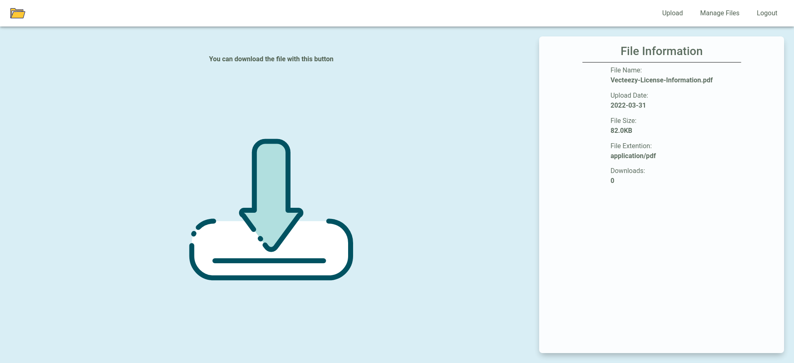

# filesharing-sample

A simple file sharing system using `nestjs`, `vuejs` and `mysql`.


## Front Side

`vuejs`.
### Screens

|   |   |
|---|---|
|  |   |
|   |   |
|   |   |
|   |   |
---

## Server side

Techs and modules: `nestjs`, `mysql`, `typeorm`, `class-validator`, `passport.js`

## Run
This project uses docker-compose. So simply clone the project and run docker-compose command:

```shell
docker-compose up
```